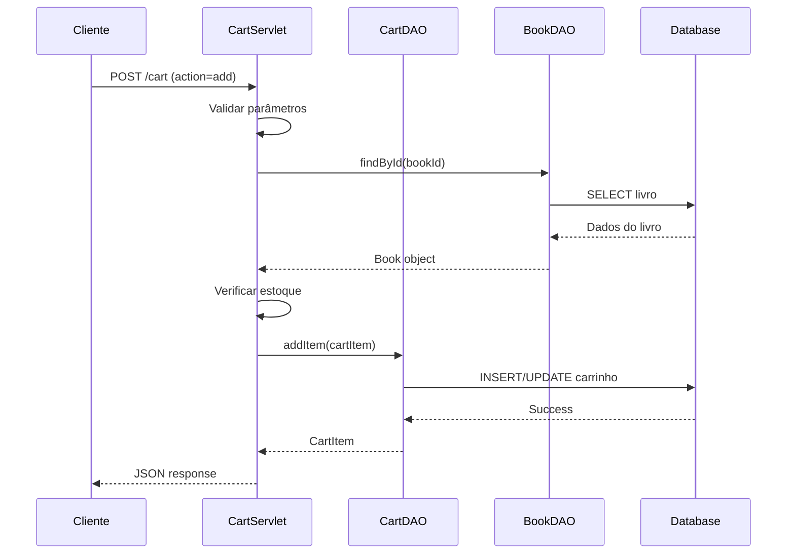

# 🏛️ Documentação da Arquitetura - Mil Páginas

Este documento detalha a arquitetura do sistema Mil Páginas, explicando as decisões de design, padrões utilizados e estrutura do código.

## 📖 Visão Geral

O Mil Páginas foi desenvolvido seguindo o padrão **MVC (Model-View-Controller)** clássico, utilizando tecnologias Java web padrão. A arquitetura prioriza simplicidade, manutenibilidade e clareza, demonstrando como construir uma aplicação robusta sem frameworks complexos.

## 🎯 Princípios Arquiteturais

### 1. **Separação de Responsabilidades**
- **Model:** Classes de domínio e lógica de negócio
- **View:** Páginas JSP para apresentação
- **Controller:** Servlets para controle de fluxo

### 2. **Baixo Acoplamento**
- Interfaces bem definidas entre camadas
- Dependências minimizadas
- Facilita manutenção e testes

### 3. **Alta Coesão**
- Cada classe tem responsabilidade única
- Funcionalidades relacionadas agrupadas
- Código mais limpo e compreensível

### 4. **Segurança por Design**
- Validação em múltiplas camadas
- Proteção contra XSS e SQL Injection
- Controle de acesso baseado em roles

## 🏗️ Estrutura em Camadas

```
┌─────────────────────────────────────┐
│          CAMADA DE APRESENTAÇÃO     │
│          (JSP + CSS + JavaScript)   │
└─────────────────┬───────────────────┘
                  │
┌─────────────────▼───────────────────┐
│          CAMADA DE CONTROLE         │
│             (Servlets)              │
└─────────────────┬───────────────────┘
                  │
┌─────────────────▼───────────────────┐
│         CAMADA DE NEGÓCIO           │
│         (Models + Utilities)       │
└─────────────────┬───────────────────┘
                  │
┌─────────────────▼───────────────────┐
│        CAMADA DE PERSISTÊNCIA       │
│              (DAO + JDBC)           │
└─────────────────┬───────────────────┘
                  │
┌─────────────────▼───────────────────┐
│         CAMADA DE DADOS             │
│            (MySQL)                 │
└─────────────────────────────────────┘
```

## 📦 Estrutura de Pacotes

### `com.milpaginas.model`
**Responsabilidade:** Representa as entidades do domínio

```java
model/
├── User.java          # Usuário do sistema
├── Book.java          # Livro do catálogo
├── CartItem.java      # Item do carrinho
├── Order.java         # Pedido
└── OrderItem.java     # Item do pedido
```

**Características:**
- POJOs simples com getters/setters
- Validações básicas
- Enums para status e tipos
- Métodos utilitários específicos do domínio

### `com.milpaginas.dao`
**Responsabilidade:** Acesso e persistência de dados

```java
dao/
├── UserDAO.java       # Operações de usuário
├── BookDAO.java       # Operações de livro
├── CartDAO.java       # Operações de carrinho
└── OrderDAO.java      # Operações de pedido
```

**Padrões Implementados:**
- **Data Access Object (DAO):** Abstrai acesso aos dados
- **Connection Management:** Controle de conexões JDBC
- **Transaction Management:** Transações manuais quando necessário

### `com.milpaginas.controller`
**Responsabilidade:** Controle de fluxo e coordenação

```java
controller/
├── LoginServlet.java      # Autenticação
├── LogoutServlet.java     # Logout
├── RegisterServlet.java   # Cadastro
├── BookServlet.java       # Gestão de livros
├── CartServlet.java       # Carrinho de compras
└── OrderServlet.java      # Gestão de pedidos
```

**Responsabilidades dos Servlets:**
- Processamento de requisições HTTP
- Validação de entrada
- Coordenação entre DAOs
- Redirecionamento e forwarding
- Gerenciamento de sessão

### `com.milpaginas.util`
**Responsabilidade:** Utilitários e funcionalidades transversais

```java
util/
├── DatabaseConnection.java    # Gestão de conexões
├── PasswordUtil.java         # Criptografia de senhas
└── ValidationUtil.java       # Validações comuns
```

### `com.milpaginas.filter`
**Responsabilidade:** Interceptação e processamento de requisições

```java
filter/
├── CharacterEncodingFilter.java  # Encoding UTF-8
├── AuthenticationFilter.java     # Controle de acesso
└── CorsFilter.java              # Headers CORS
```

### `com.milpaginas.listener`
**Responsabilidade:** Eventos do ciclo de vida da aplicação

```java
listener/
└── ApplicationStartupListener.java  # Inicialização da aplicação
```

## 🔄 Fluxo de Dados

### 1. **Requisição HTTP**
```
Cliente → Filtros → Servlet → DAO → Banco de Dados
```

### 2. **Resposta HTTP**
```
Banco de Dados → DAO → Model → JSP → Cliente
```

### 3. **Exemplo: Adicionar ao Carrinho**


## 🗄️ Modelo de Dados

### Entidades Principais

#### **Usuários**
```sql
usuarios (
    id INT PRIMARY KEY,
    nome VARCHAR(100),
    email VARCHAR(150) UNIQUE,
    senha VARCHAR(255),
    endereco TEXT,
    telefone VARCHAR(20),
    tipo_usuario ENUM('CLIENTE', 'ADMINISTRADOR'),
    data_cadastro TIMESTAMP,
    ativo BOOLEAN
)
```

#### **Livros**
```sql
livros (
    id INT PRIMARY KEY,
    titulo VARCHAR(200),
    autor VARCHAR(150),
    isbn VARCHAR(20) UNIQUE,
    editora VARCHAR(100),
    ano_publicacao YEAR,
    preco DECIMAL(10,2),
    quantidade_estoque INT,
    url_capa VARCHAR(500),
    descricao TEXT,
    data_cadastro TIMESTAMP,
    ativo BOOLEAN
)
```

#### **Relacionamentos**
- **Carrinho:** N:N entre Usuario e Livro
- **Pedidos:** 1:N entre Usuario e Pedido
- **Itens do Pedido:** N:N entre Pedido e Livro

## 🔐 Segurança

### 1. **Autenticação**
- Senhas criptografadas com salt
- Sessões HTTP para controle de estado
- Timeout automático de sessão

### 2. **Autorização**
- Filtro de autenticação para áreas protegidas
- Controle baseado em roles (CLIENTE/ADMIN)
- Verificação de propriedade de recursos

### 3. **Proteção contra Ataques**

#### **SQL Injection**
```java
// ❌ Vulnerável
String sql = "SELECT * FROM usuarios WHERE email = '" + email + "'";

// ✅ Seguro
String sql = "SELECT * FROM usuarios WHERE email = ?";
PreparedStatement stmt = conn.prepareStatement(sql);
stmt.setString(1, email);
```

#### **XSS (Cross-Site Scripting)**
```java
// Sanitização de entrada
public static String sanitizeString(String input) {
    if (input == null) return null;
    return input.trim()
            .replaceAll("<", "&lt;")
            .replaceAll(">", "&gt;")
            .replaceAll("\"", "&quot;")
            .replaceAll("'", "&#x27;");
}
```

#### **CSRF (Cross-Site Request Forgery)**
- Verificação de referer
- Tokens de sessão
- Validação de origem

## 🎨 Padrões de Design Utilizados

### 1. **Model-View-Controller (MVC)**
- **Model:** Entidades de domínio
- **View:** Páginas JSP
- **Controller:** Servlets

### 2. **Data Access Object (DAO)**
- Abstração do acesso a dados
- Independência de tecnologia de persistência
- Facilita testes unitários

### 3. **Front Controller**
- Servlets centralizando controle
- Processamento uniforme de requisições
- Facilita implementação de concerns transversais

### 4. **Transfer Object**
- Models como objetos de transferência
- Dados estruturados entre camadas
- Reduz acoplamento

### 5. **Factory Method**
- DatabaseConnection para criação de conexões
- Centraliza lógica de criação
- Facilita configuração

## 🔧 Configuração e Deployment

### **Web.xml - Configuração Central**
```xml
<!-- Mapeamento de Servlets -->
<servlet-mapping>
    <servlet-name>BookServlet</servlet-name>
    <url-pattern>/books</url-pattern>
</servlet-mapping>

<!-- Filtros -->
<filter>
    <filter-name>AuthenticationFilter</filter-name>
    <filter-class>com.milpaginas.filter.AuthenticationFilter</filter-class>
</filter>

<!-- Páginas de Erro -->
<error-page>
    <error-code>404</error-code>
    <location>/error/404.jsp</location>
</error-page>
```

### **Configuração de Banco**
```properties
# db.properties
db.url=jdbc:mysql://localhost:3306/milpaginas
db.username=user
db.password=pass
db.driver=com.mysql.cj.jdbc.Driver
```

## 📊 Performance e Escalabilidade

### **Otimizações Implementadas**

1. **Conexões de Banco:**
   - Reutilização de conexões
   - Fechamento adequado de recursos
   - Prepared Statements

2. **Consultas SQL:**
   - Índices nas tabelas
   - Queries otimizadas
   - Paginação de resultados

3. **Frontend:**
   - CSS/JS minificados
   - Lazy loading de imagens
   - Cache de browser

### **Pontos de Melhoria**

1. **Connection Pooling:**
```java
// Implementar pool de conexões
<Resource name="jdbc/milpaginas"
          auth="Container"
          type="javax.sql.DataSource"
          maxTotal="20"
          maxIdle="10" />
```

2. **Cache:**
```java
// Cache de livros mais acessados
private static Map<Integer, Book> bookCache = new ConcurrentHashMap<>();
```

3. **Paginação Avançada:**
```sql
-- Cursor-based pagination
SELECT * FROM livros WHERE id > ? ORDER BY id LIMIT ?
```

## 🧪 Testabilidade

### **Estrutura Preparada para Testes**

1. **Separação de Responsabilidades**
   - DAOs testáveis independentemente
   - Lógica de negócio isolada
   - Mocks possíveis

2. **Configuração Flexível**
   - Banco de dados configurável
   - Ambientes separados
   - Properties externalizadas

3. **Exemplo de Teste:**
```java
@Test
public void testUserLogin() {
    UserDAO userDAO = new UserDAO();
    User user = userDAO.findByEmail("test@example.com");
    
    assertTrue(PasswordUtil.verifyPassword("password", user.getSenha()));
}
```

## 🔮 Extensibilidade

### **Pontos de Extensão Identificados**

1. **Novos Tipos de Usuário:**
```java
public enum UserType {
    CLIENTE, ADMINISTRADOR, VENDEDOR, GESTOR
}
```

2. **Diferentes Formas de Pagamento:**
```java
public interface PaymentProcessor {
    PaymentResult process(Order order, PaymentInfo info);
}
```

3. **Múltiplos Idiomas:**
```jsp
<%@ taglib prefix="fmt" uri="http://java.sun.com/jsp/jstl/fmt" %>
<fmt:message key="welcome.message" />
```

## 📝 Decisões Arquiteturais

### **Por que não usar Frameworks?**

1. **Objetivo Educacional:**
   - Demonstrar fundamentos Java web
   - Entender funcionamento interno
   - Controle total sobre implementação

2. **Simplicidade:**
   - Menos dependências
   - Menor curva de aprendizado
   - Facilita debugging

3. **Performance:**
   - Overhead mínimo
   - Controle direto de recursos
   - Otimizações específicas

### **Por que MySQL?**

1. **Popularidade e Suporte**
2. **Performance adequada**
3. **Facilidade de configuração**
4. **Compatibilidade com JDBC**

### **Por que Servlets + JSP?**

1. **Padrão da indústria**
2. **Maturidade tecnológica**
3. **Ampla documentação**
4. **Base para frameworks modernos**

## 🎯 Conclusão

A arquitetura do Mil Páginas demonstra como construir uma aplicação web robusta e escalável usando tecnologias Java clássicas. A estrutura modular, padrões bem definidos e separação clara de responsabilidades criam uma base sólida para desenvolvimento e manutenção contínua.

A simplicidade da arquitetura facilita o entendimento e permite foco nas funcionalidades de negócio, enquanto os padrões implementados garantem qualidade e manutenibilidade do código.

---

**📚 Esta arquitetura serve como excelente exemplo de como aplicar princípios sólidos de engenharia de software em projetos Java web.**